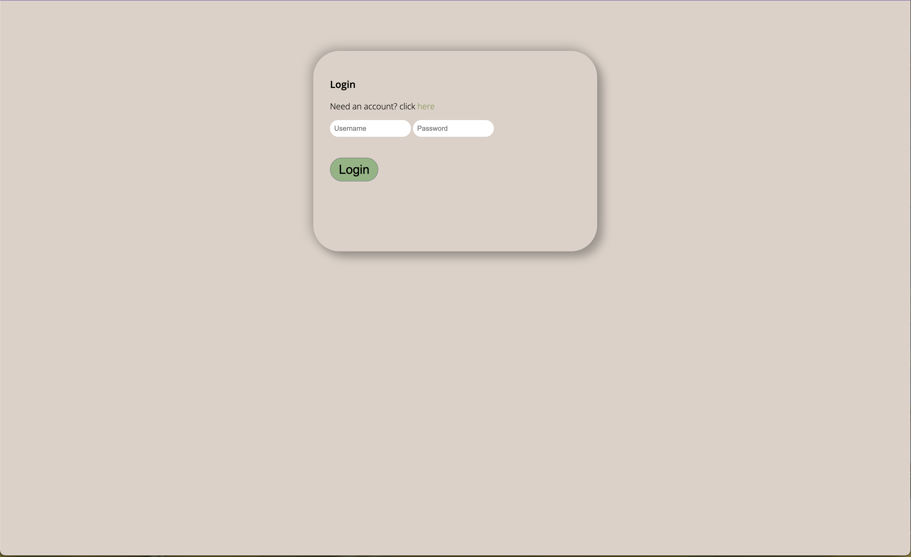
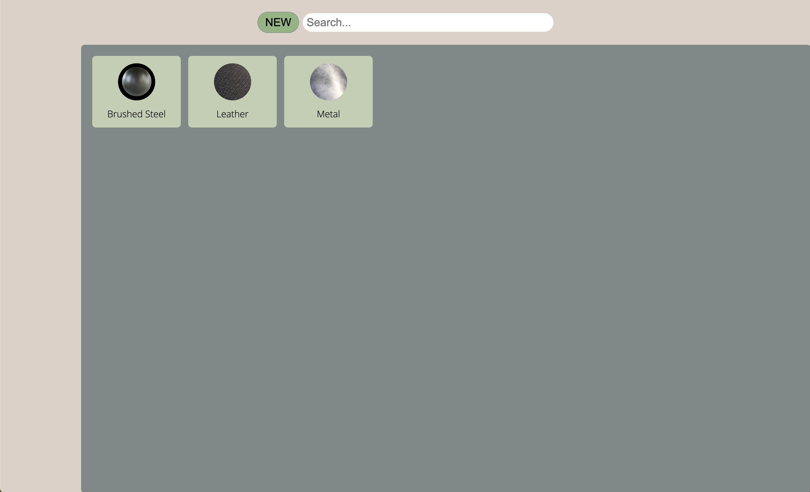
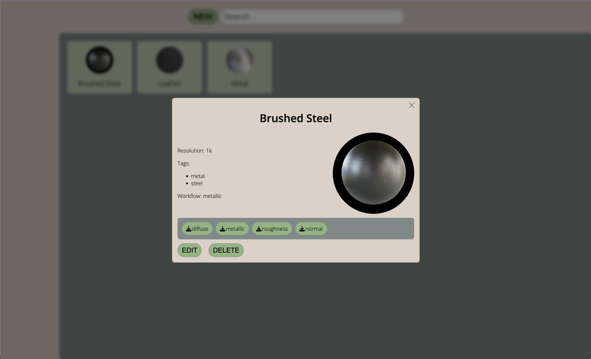
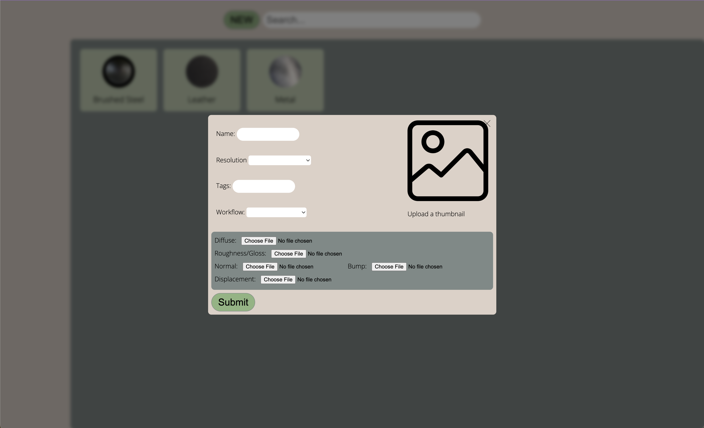

# Midterm Project

## Overview

An online material library for storage and quick access of low resolution materials for background objects in 3D rendering.

## Resources

**Material List**

(Maps entries contain string keys for retrieving image file from AWS storage)

Attributes:
* Name (String)
* Resolution (String)
* Tags (Array of strings)
* Workflow (String)
* Maps (Object)
    * Thumbnail (String)
    * Diffuse (String)
    * Metallic (String)
    * Specular (String)
    * Roughness (String)
    * Normal (String)
    * Bump (String)
    * Displacement (String)

## Model

```javascript
mongoose.model("Material", {
    name: {
            type: String,
            required: true
    },
    resolution: {
        type: String,
        required: true
    },
    tags: [String],
    workflow: {
        type: String,
        required: true
    },
    maps: {
        thumbnail: String,
        diffuse: String,
        metallic: String,
        specular: String,
        roughness: String,
        normal: String,
        bump: String,
        displacement: String,
    }
})
```

## REST Endpoints

Name                             | Method | Path
---------------------------------|--------|-------------
Retrieve materials collection    | GET    | /materials
Retrieve materials member        | GET    | /materials/*\<id\>* 
Create materials member          | POST   | /materials
Update materials member          | PUT    | /materials/*\<id\>* 
Delete materials member          | DELETE | /materials/*\<id\>* 

## Screenshots




